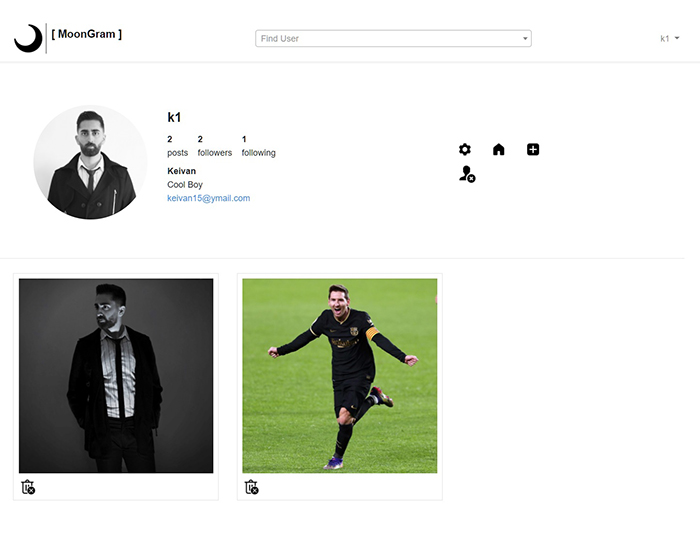

# Social Network
This is our final project for the IE(Internet Engineering) course at the University of Guilan in the fall semester of 2020.

## MoonGram

### Features of this app:
- Register in the app with a unique username and mail
- Log in with the mail and password
- Email to reset the password if the password is forgotten
- Delete account
- Each user has his own dashboard
- Change the profile info and profile image
- Search and find users with a username
- Follow and unfollow users
- Add posts with comment
- Delete posts
- See the posts of other users(users that you follow) on the home page

### Technologies
- PHP 7.1.3
- Composer 2.0.8
- Laravel 5.8
- npm 6.14.8
- Bootstrap v4.5.3
- Vue 2.5.17
- Jquery 3.2
- Axios 0.21.1
- Select2 4.1.0

### Steps to clone and run the project
- Clone the project
- Composer update
- npm install
- npm audit fix
- npm run dev
- rm -rf public/storage(in windows, you can go to the public directory and remove the storage directory)
- php artisan storage:link
- php artisan serve 

